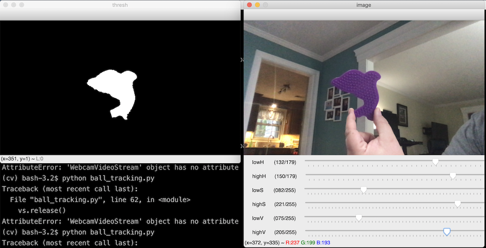

# opencv_class


# getting started
- Linux cheatsheet:  https://files.fosswire.com/2007/08/fwunixref.pdf
- Python cheatsheet: https://perso.limsi.fr/pointal/_media/python:cours:mementopython3-english.pdf


## Step 1:   
- Clone this repo:  
  - `git clone https://github.com/IgniteRobotics/opencv_class.git`
- Open the IDE and open 
  - `ball_tracking.py`

## What you see:

### A bunch of imports
``` python
# import the necessary packages
from collections import deque
from imutils.video import VideoStream
import numpy as np
import argparse
import cv2
import imutils
import time
```

### A basic structure

``` python
# define the lower and upper boundaries of the "green"
# ball in the HSV color space, then initialize the
# list of tracked points
greenLower = (0, 0, 0)
greenUpper = (179, 255, 255)
pts = deque(maxlen=64)
 
#grab the reference to the webcam
vs = VideoStream(src=0).start()
 
 
# allow the camera or video file to warm up
time.sleep(2.0)

# keep looping
while True:
	# grab the current frame
	frame = vs.read()
 
	
	# if you don't get a frame.  we can't continue
	if frame is None:
		break

	# resize the frame, blur it, and convert it to the HSV
	# color space
 
	# construct a mask for the color "green", then perform
	# a series of dilations and erosions to remove any small
	# blobs left in the mask

	# find contours in the mask and initialize the current
	# (x, y) center of the ball
 
	# only proceed if at least one contour was found


	# update the points queue

	# loop over the set of tracked points
 
	# show the frame to our screen
	cv2.imshow("Frame", frame)
	key = cv2.waitKey(1) & 0xFF
 
	# if the 'q' key is pressed, stop the loop
	if key == ord("q"):
		break
 
vs.stop()
 
# close all windows
cv2.destroyAllWindows()

```

## resize, BGR -> HSV

- Let's resize the image so it's not so big.
- Blur it so the edges are a little smoother
- Convert it to HSV

``` python
	# resize the frame, blur it, and convert it to the HSV
	# color space
	frame = imutils.resize(frame, width=600)
	blurred = cv2.GaussianBlur(frame, (11, 11), 0)
	hsv = cv2.cvtColor(blurred, cv2.COLOR_BGR2HSV)
```
- You learned RBY in school
- You probably know RGB
- What's HSV?
    - Hue is the color portion of the model
    - Saturation describes the amount of gray in a particular color, from 0 to 100 percent.
    - Value works in conjunction with saturation and describes the brightness or intensity.


### Finding HSV values 

- Let's run this to find good HSV values.

> `python3 threshholding.py`



- update the values in your code
``` python
greenLower = (29, 86, 6)
greenUpper = (64, 255, 255)
```


## Apply your HSV mask.
- Now only that color shows up in your image.
- Smooth the edges.

```
	# construct a mask for the color "green", then perform
	# a series of dilations and erosions to remove any small
	# blobs left in the mask
	mask = cv2.inRange(hsv, greenLower, greenUpper)
	mask = cv2.erode(mask, None, iterations=2)
	mask = cv2.dilate(mask, None, iterations=2)
```

## Find and select contours

### THIS IS THE IMPORTANT BIT!

- Use opencv to find all the blobs that match your HSV mask.
- Put them in a list.
- Find the center and radius
- We only care if it's big enough.
- Draw a circle on it.


``` python
	# find contours in the mask and initialize the current
	# (x, y) center of the ball
	cnts = cv2.findContours(mask.copy(), cv2.RETR_EXTERNAL,
		cv2.CHAIN_APPROX_SIMPLE)
	cnts = imutils.grab_contours(cnts)
	center = None
 
	# only proceed if at least one contour was found
	if len(cnts) > 0:
		# find the largest contour in the mask, then use
		# it to compute the minimum enclosing circle and
		# centroid
		c = max(cnts, key=cv2.contourArea)
		((x, y), radius) = cv2.minEnclosingCircle(c)
		M = cv2.moments(c)
		center = (int(M["m10"] / M["m00"]), int(M["m01"] / M["m00"]))
 
		# only proceed if the radius meets a minimum size
		if radius > 10:
			# draw the circle and centroid on the frame,
			# then update the list of tracked points
			cv2.circle(frame, (int(x), int(y)), int(radius),
				(0, 255, 255), 2)
			cv2.circle(frame, center, 5, (0, 0, 255), -1)
 ```

 ### Question:  What color are the circles?  Can you fine where to the big one?

## Now for some fun.  Tracking points
- Put the center into a list
- Draw a line between the last 2 centers. Newer lines are bigger.  Eventually they dissapear.
``` python
# update the points queue
	pts.appendleft(center)

	# loop over the set of tracked points
	for i in range(1, len(pts)):
		# if either of the tracked points are None, ignore
		# them
		if pts[i - 1] is None or pts[i] is None:
			continue
 
		# otherwise, compute the thickness of the line and
		# draw the connecting lines
		thickness = int(np.sqrt(64 / float(i + 1)) * 2.5)
		cv2.line(frame, pts[i - 1], pts[i], (0, 0, 255), thickness)
 ```

 ### Question:  Can you make it track less or more points?

# LET's RUN IT!

## Advanced topic: Calculating Angle to Target.

### This is all jumbled up and wrong.  
### Can you fix it?

### Some constants
``` python
#incoming image dimensions and FOV settings of a USB web cam.  NOT THE PI CAM.
image_width = 640
image_height = 480

diagonalFOV = math.radians(78)
horizontalAspect = 16
verticalAspect = 9

horizontalFOV = math.radians(70.42) 
verticalFOV = math.radians(43.3)

H_FOCAL_LENGTH = image_width / (2*math.tan((horizontalFOV/2)))
V_FOCAL_LENGTH = image_height / (2*math.tan((verticalFOV/2)))
```

### Calculating Yaw.
```python
def calculateYaw(pixelX, centerX, hFocalLength):
    yaw = math.degrees(math.atan((pixelX - centerX) / hFocalLength))
    return yaw
```

### Using it.

``` python
target_angle = calculateYaw(x_target, mid_frame, H_FOCAL_LENGTH)

cv2.putText(frame, "X Angle: " + "{:7.2f}".format(x_angle), (20, 20), cv2.FONT_HERSHEY_SIMPLEX,0.75, (255, 255, 255), thickness=2)
```


